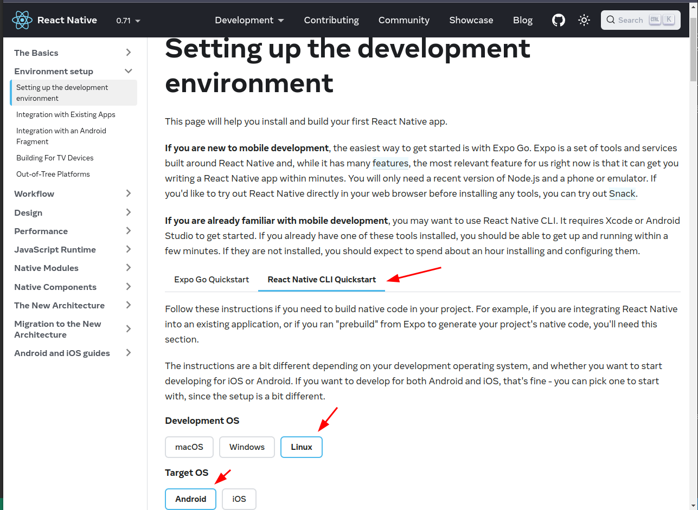
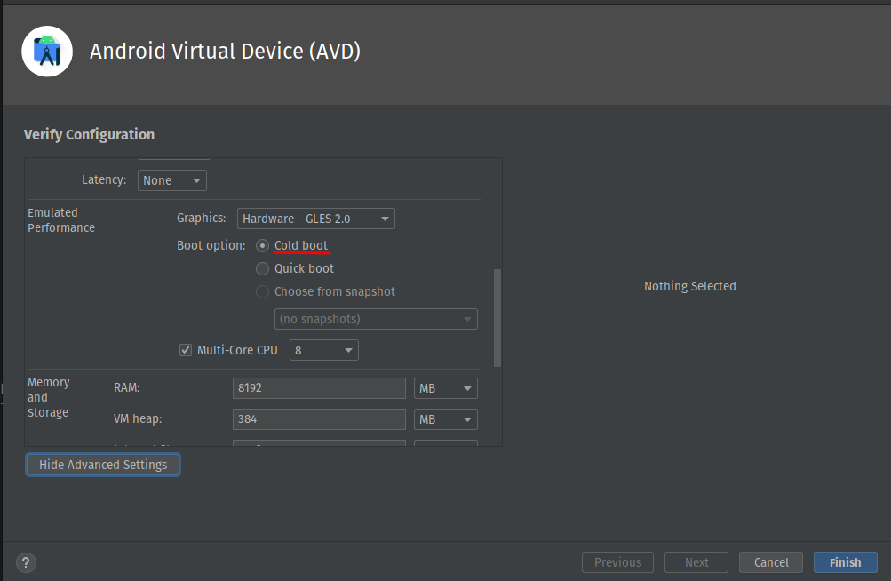

### > references
- App routes and navigation: https://www.youtube.com/watch?v=Bbi4WItP-Uo&ab_channel=Rocketseat
  
### > designs
- App figma: https://www.figma.com/file/cIKyGwpc2rdRmCLYtcrR9A/Untitled?node-id=0%3A1
- App icons: https://icons.expo.fyi/


### > **configure development ambient**

- **ubuntu/debian based distributions**
  - **esp32**
    - install arduinoIDE (automatically install drivers to esp)
      ```sh
      flatpak install flathub cc.arduino.arduinoide -y
      ```
    - install vscode 
      ```sh
      flatpak install flathub com.visualstudio.code -y
      ```
    - install platformIO
      - inside vscode install platformIO extension 
      - if you get `can't find usbport` or `permission denied usbport` `erro` when flashing code into the esp try installing **99-platformio-udev.rules** [link](https://docs.platformio.org/en/stable/core/installation/udev-rules.html)
  - **expo app**
    - install nodejs
      - it should come with npm and npx if not install both, use npm to install yarn and use npx to run expo commands
      - after installing npx run expo cli commands with npx [link](https://docs.expo.dev/get-started/installation/)
    - install yarn for easy time with all libs dependency management
    - install expoGO on your phone to run the app
  - **android studio app**
    - to install and config android studio follow the instructions (steps 1 to 3) at https://reactnative.dev/docs/environment-setup
    - in the beginning of the page make sure to mark the following options
        

    - step 1 to install android studio just run following command
      ```sh
      flatpak install flathub com.google.AndroidStudio
      ```
    - step 2 do exactly as it says at the page
    - step 3 config ANDROID_HOME at your `~/.bashrc` file
      ```sh
      export ANDROID_HOME=$HOME/Android/Sdk
      export PATH=$PATH:$ANDROID_HOME/emulator
      export PATH=$PATH:$ANDROID_HOME/platform-tools
      ```
    - install watchman
      ```sh
      sudo apt install watchman
      ```
    - install openJDK 11 (android studio needs openJDK 11 or higher)
      - config JAVA_HOME at your `~/.bashrc` file
        ```sh
        JAVA_HOME=/usr/lib/jvm/java-11-openjdk-amd64
        export JAVA_HOME
        export PATH=$PATH:${JAVA_HOME}/bin
        ```
    - create a virtual device
      - make sure to use `cold boot` at advanced options, so when the app crashes or freezes you can just close and reopen it without it trying to restore to the crash state wich can take a lot of time

